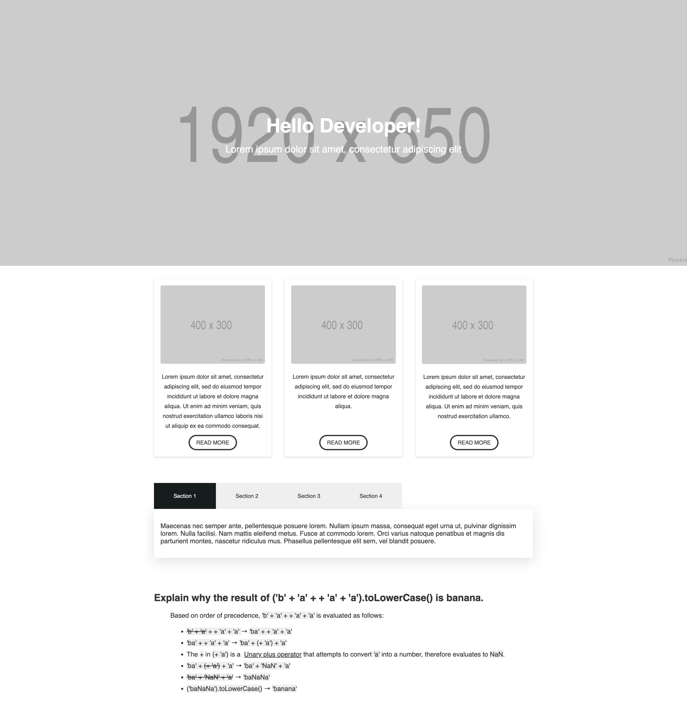

Introduction
---
Simple frontend assessment for MindArc.

## How to run?
Execute `npm run start` in the root directory.

Exercise 1
---
Build a responsive page based on the designs.

##### Requirements
1. :white_check_mark: Match the designs exactly.
2. :white_check_mark: Needs to be responsive.

##### Designs
* exercise1-desktop.png
* exercise1-mobile.png

##### Assets
* Desktop banner - https://via.placeholder.com/1920x650
* Mobile banner - https://via.placeholder.com/600x600
* Content images - https://via.placeholder.com/400x300

Exercise 2
---
Read the `data.json` file and display the data as tabs on desktop and an accordion on mobile.

##### Requirements
1. :white_check_mark: Display data in tabs on desktop.
2. :white_check_mark: Display data in an accordion on mobile.
3. :white_check_mark: Only 1 accordion/tab should be open at a time.
4. :white_check_mark: Open the first accordion/tab on load.
5. :white_check_mark: If the open accordion is selected, close it.

###### Bonus points
* :white_check_mark: Improve the user experience with meaningful animations/transitions.
* :white_check_mark: Design and styling.
* :white_check_mark: Explain why the result of `('b' + 'a' + + 'a' + 'a').toLowerCase()` is `banana`.

Submission
---
We recommend submitting your completed assessment as a forked repository. Please replace README content with instructions and relevant documentation.
